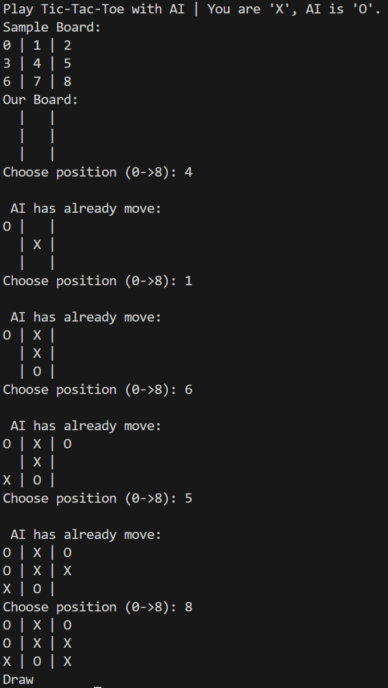

# ❌⭕ Tic-Tac-Toe Game (Python)

A clean, modular Python implementation of the classic Tic-Tac-Toe game. Designed with a focus on readable code structure, error handling, and an extensible architecture for future AI integration.

## 🌟 Key Features
* **Interactive Gameplay:** Smooth Command-Line Interface (CLI).
* **Robust Input Validation:** Prevents invalid moves, out-of-bounds coordinates, and non-integer inputs.
* **Game Logic Engine:** Automatic win, loss, and draw condition checks after every move.

## 🛠️ Tech Stack
* **Language:** Python 3.x
* **Libraries:** Standard Python Libraries (`math`, `random`)

## 🚀 Getting Started

1. **Clone the repository:**
   ```bash
   git clone https://github.com/vinhnd281209/tictactoe-python.git
   cd tictactoe-python

2. **Run the game:**
    ```bash
    python TicTocToe.py
    ```
3. **POV Gameplay:**
    

🎯 Future Improvements (AI Roadmap)

Planned enhancements to align with AI/ML research goals:

- Minimax Algorithm: Implement an unbeatable AI agent using decision tree search.

- Alpha-Beta Pruning: Optimize the algorithm for faster decision-making.

👤 Author
Nguyen Duc Vinh - GitHub Profile

Email: vinhnd666@gmail.com